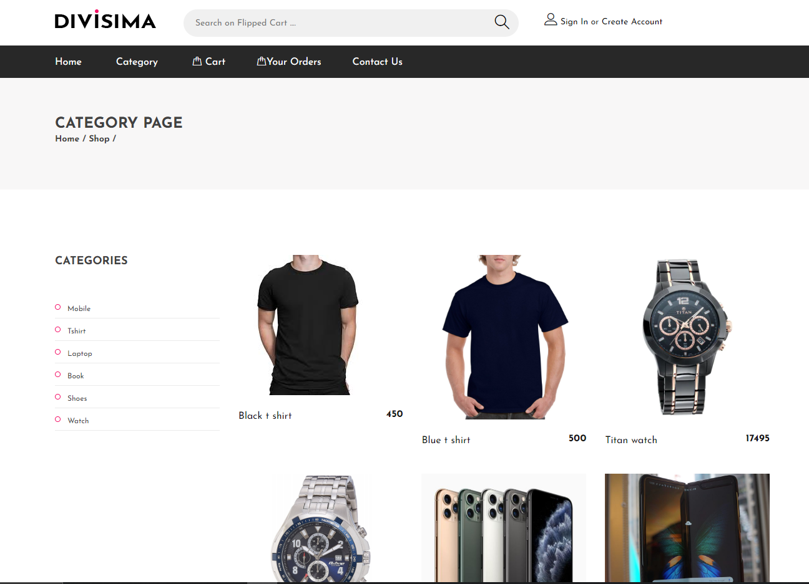
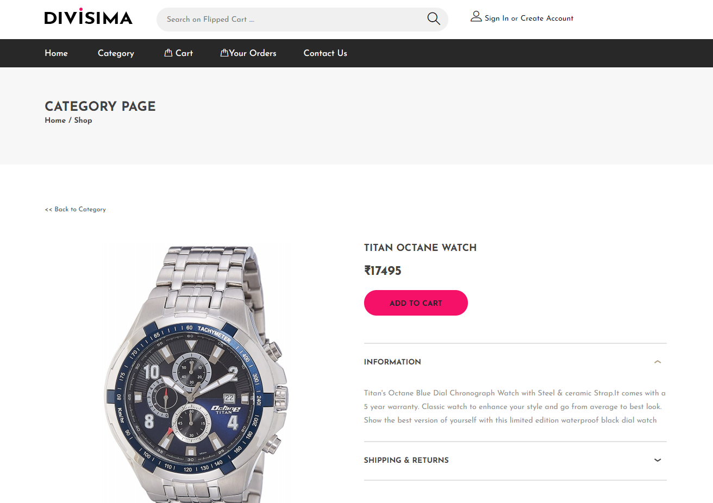

# Flipped Cart is an E-commerce website.
### Website is developed in nodejs and express using sqlite as database and ejs as templates.

## Features
1. All the functionality of an E-commerce website.
1. User Authentication storing information like name, password, address, phone number, ACC details etc.
1. List of all the products, filter through categories, user cart, user orders.
1. Admin page for admin of the website to see all the orders that are there to process.
1. Admin page has functionality to change status of orders to 'processing' or 'shipped' or 'on the way' or 'delivered'
1. Users are shown the estimated delivery and date or order.
1. Uses sqlite database and ejs templating engine.

## Features to implement in future
1. To implement payment methods using stripe.js node package.
1. To implement admin pannel to add new products without using database using admin bro node package.
1. To implement more complex database schema instead of simple one.

### Screenshots

